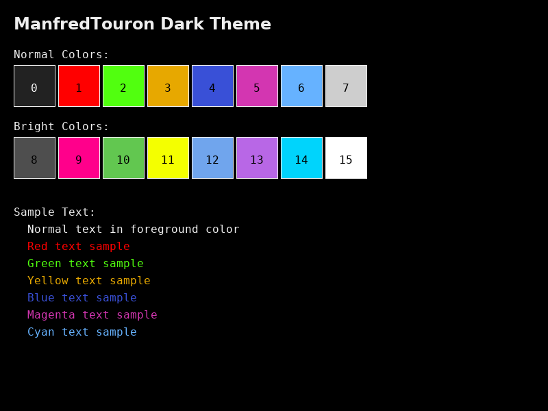
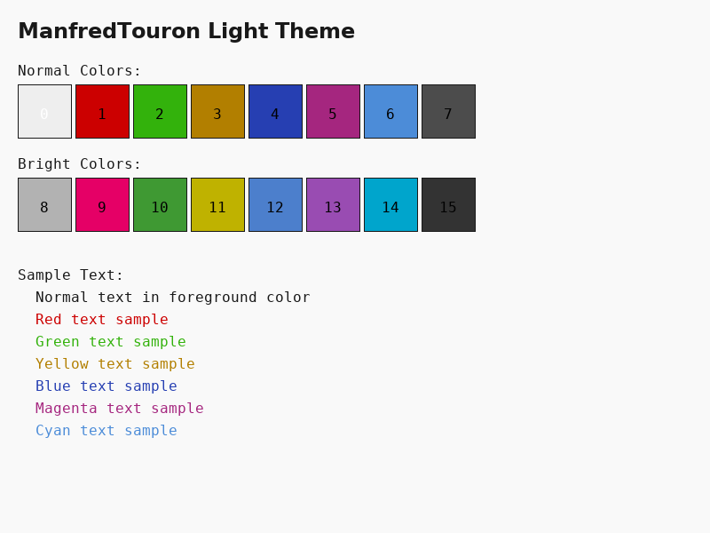
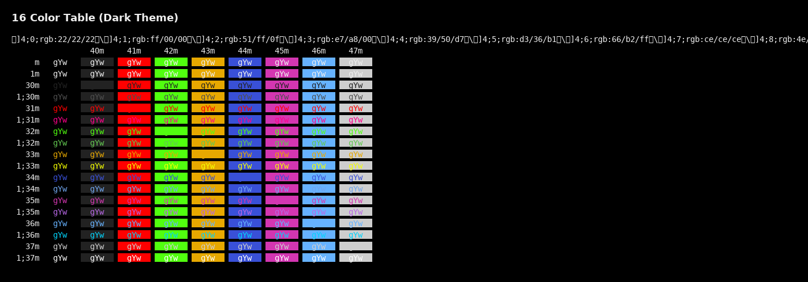
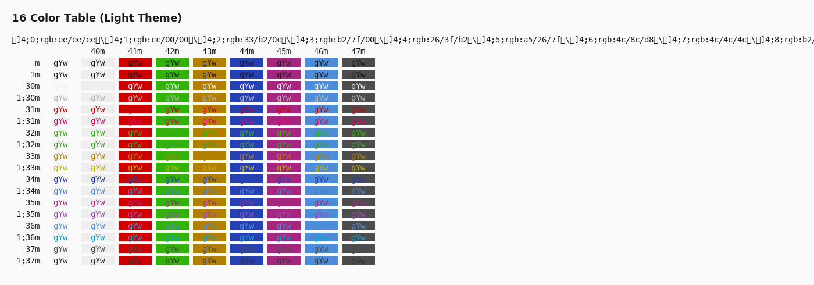
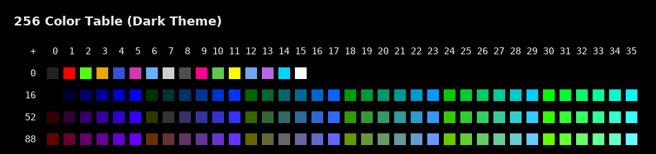
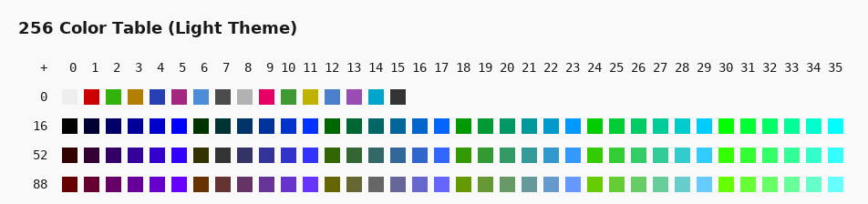
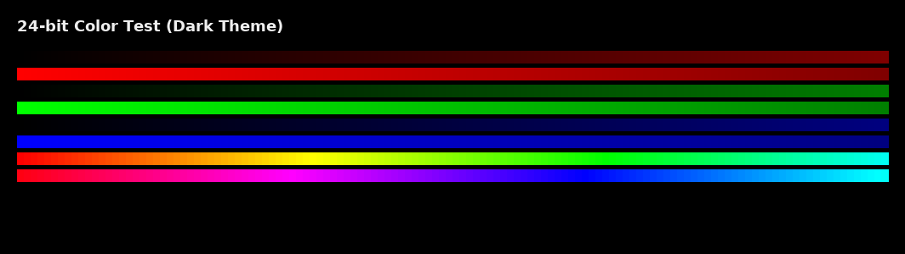
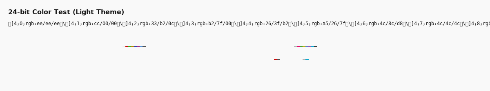

# moul/colorscheme
Personal color scheme for my terminals etc

## Features

- **Dark and Light variants** - Optimized for different lighting conditions
- **Dynamic theme switching** - Automatically switch based on system preferences or time
- **Wide terminal support** - iTerm2, Kitty, VS Code, Xresources, Blink, and more

## Screenshots

### Theme Previews

| Dark Theme | Light Theme |
|------------|-------------|
|  |  |

### Color Tables

#### 16 Color Table
| Dark Theme | Light Theme |
|------------|-------------|
|  |  |

#### 256 Color Table  
| Dark Theme | Light Theme |
|------------|-------------|
|  |  |

#### 24-bit Color Test
| Dark Theme | Light Theme |
|------------|-------------|
|  |  |

### Original Terminal Screenshot

